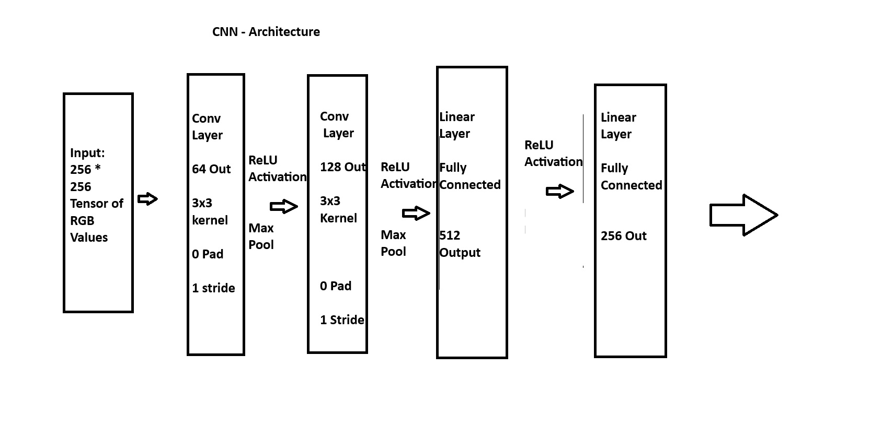
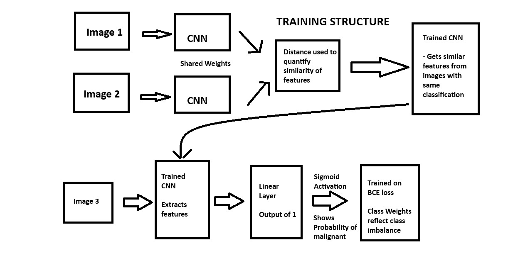
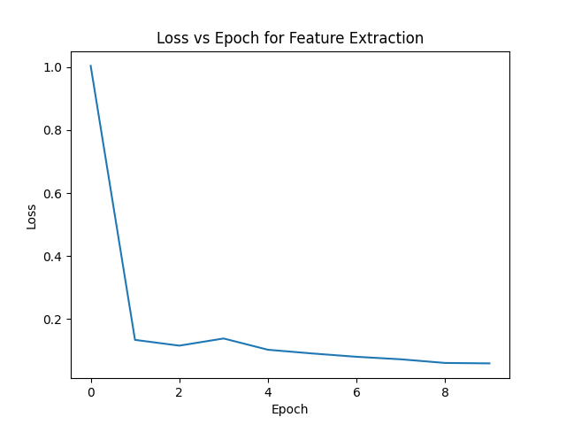
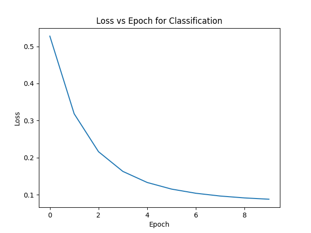

# Siamese Network Classifier
## s4742616 Philip Burke COMP3710 Report

### File Description
dataset.py: Contains helper functions in order to load dataset into one of 2 custom dataset classes. Handles pre-processing of data and loading into training modules. Has some adjustable parameters about size of dataset used, filenames etc.

module.py: Contains code outlining the Siamese network module. To be called by train.py

train.py: Contains the training algorithm for the Siamese Network. Run by calling train.py, saves trained model into file "model.pt". Model has function model.predict() to use for predictions/using model.

predict.py: Tests results of model against test set. Computes accuracy, precision and recall for both classes. Run by calling predict.py, requires a saved model in model.pt.

## Justification Of Decisions/Background Information
### Dataset Information

The dataset consisted of 33,126 dermoscopic .jpg images of benign and malignant skin lesions. Images varied in size and shape considerably. The test dataset provided on the ISIC2020 website contained no ground truth about the correct status of the lesion and so the choice was made to split the training dataset in order for predictions to be made about the generalisation of the performance of the algorithm.

There was significant class imbalance in the training set as 98.2% of the images were benign. 

### Pre-Processing
The pre-processing procedure was relatively straightforward. Since the data was all in .jpg format, it was converted to a tensor with 3 channels for RGB. The choice was made to keep all three rather than convert to greyscale as colour was found to be a predictor of melanoma (Mayo Clinic, 2025).

Due to the size of the dataset, loading the entire image directory into memory proved to be impossible and caused issues. Because of this, the decision was made to pre-process in batches as the data was being loaded to be used by the network. The decision obviously caused a bottleneck in performance, but allowed the algorithm to run without significant load on memory. This was done by creating two custom datasets in order to take advantage of torch's DataLoader, and in particular, the parallel workers that it is able to utilize.

The nature of a Siamese network meant that the network needed to have pairs of data, with labels reflecting the similarity of the images also. The custom dataset structure allowed for this to be easily loaded into to training process.

The actual preprocessing steps were incredibly straightforward. The only step was to convert to a tensor and then reshape into a 256*256 image. On reflection, to improve results, data augmentation such as horizontal flips or rotations should have been used as these would have allowed for a more robust model with better generalisation performance.

### Algorithm
The classifier worked by learning how to extract features from the images using a CNN that was optimized to minimize the Euclidean distance between 'similar' (i.e same label) images and maximise the distance between dissimilar images. From these extracted features a simple linear classifier was trained that would predict the class of the image.

The CNN had only 2 convolutional layers with ReLU activation and max pooling, before a fully connected layer mapped to a series of 'features'. A diagram of the CNN is shown below:

In order to extract the features, a pair of images, along with a label reflecting their similarity were loaded into a CNN. The CNN was then applied to both images and the Euclidean distance between the two was used as part of the loss function. This way, the network would learn how to extract features from images such that similar results i.e both benign or both malignant would give similar features which would make classifying the images easier.

After the network was trained to extract features from pairs of similar images, the linear classifier was trained using Binary Cross Entropy loss. The classifier would map from the features to a single point which would reflect the probability of a malignant lesion. Outputting as a probability (rather than just a classification) allowed more flexibility from the loss function. A diagram of the entire classification training process is shown below:

### Results

The loss converge in training indicate that the model successfully converged:

Due to the massive imbalance in the classes, getting an 'accuracy of 0.8' as per the task requirements would be very simple as a classifier that predicted benign each time would get an accuracy of 0.983. The overall accuracy of the classifier was 98.14%, which is lower than guessing benign every time. The results in some other metrics are shown below:

|Metric | Benign | Malignant |
|---|---|---|
|Recall|0.9832 |0.8793|
|Precision|0.9977 |0.4857|

Since the classifier was attempting to classify medical images, a high recall for the positive class (a malignant lesion) is the goal for the classifier, as long as the accuracy is still reasonable. This is because false positives from the classifier are more 'safe' and less damaging then false negatives in the context of diagnosing lesions.

As such, due to the high accuracy and high recall of the model, it can be viewed overall as successful. There are a number of things that I would do differently were I to do this again, such as better data pre-processing with added augmentation, more complex CNN structure to get better extraction of features and a more sophisticated classifier i.e logistic regression rather than the linear layer.

### Dependencies

Random State was set to 354 for random shuffling/creating pairs at beginning of training process.

colorama==0.4.6
contourpy==1.3.3
cycler==0.12.1
filelock==3.20.0
fonttools==4.60.1
fsspec==2025.9.0
Jinja2==3.1.6
joblib==1.5.2
kiwisolver==1.4.9
MarkupSafe==3.0.3
matplotlib==3.10.7
mpmath==1.3.0
networkx==3.5
numpy==2.3.4
packaging==25.0
pandas==2.3.3
pillow==12.0.0
pyparsing==3.2.5
python-dateutil==2.9.0.post0
pytz==2025.2
scikit-learn==1.7.2
scipy==1.16.3
setuptools==80.9.0
six==1.17.0
sympy==1.14.0
threadpoolctl==3.6.0
torch==2.9.0
torchvision==0.24.0
tqdm==4.67.1
typing_extensions==4.15.0
tzdata==2025.2

### References

https://www.mayoclinic.org/diseases-conditions/melanoma/in-depth/melanoma/art-20546856